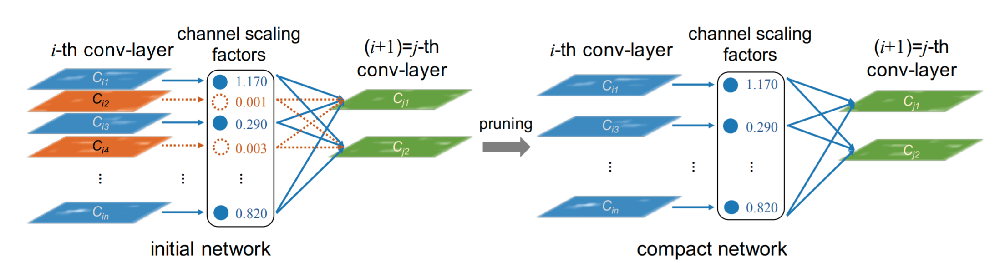
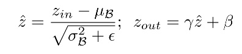
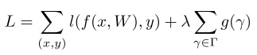
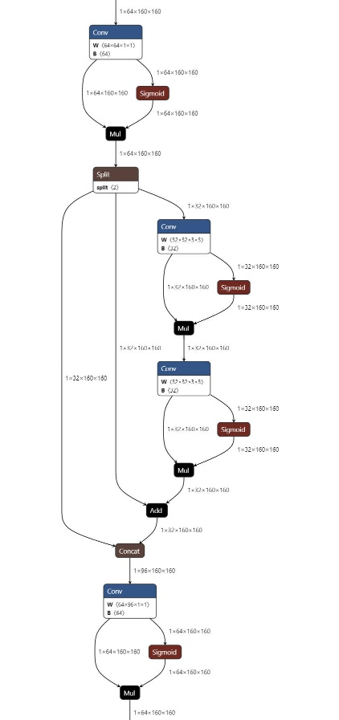
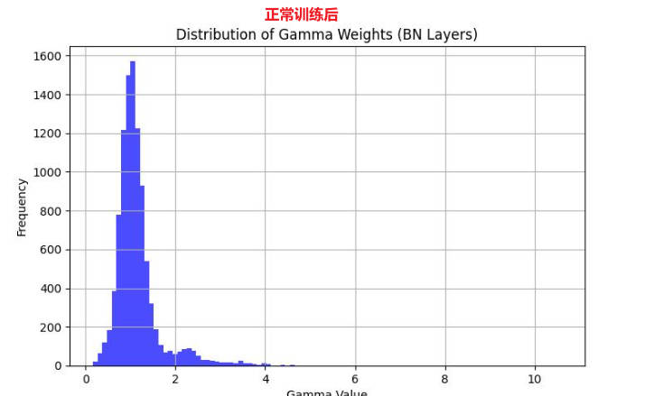
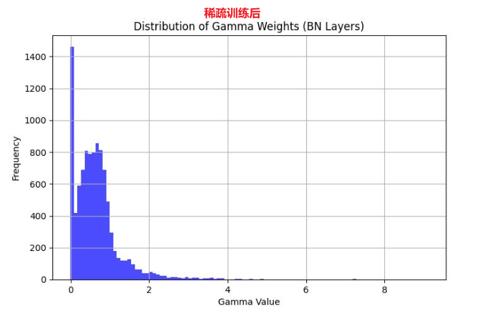

# YOLOv8 Pruning

**Original Content. Please credit the source when referencing.**

------

## Related Principles

The pruning methodology is inspired by the following research papers:

- **Learning Efficient Convolutional Networks Through Network Slimming**
- **Pruning Filters for Efficient ConvNets**

------

## Pruning Methodology

The pruning process is based on the **gamma coefficient** in Batch Normalization (BN) layers.

In a **Conv-BN-Activation** module, the BN layer is responsible for channel scaling, as shown below:



### BN Layer Operations

The BN layer performs two main operations:

1. **Normalization:** Adjusts the input to have zero mean and unit variance.

2. **Linear Transformation:** Applies a scaling factor `gamma` and a shift `beta`.

   

When the `gamma` coefficient is very small, the corresponding activations become negligible. These low-activation outputs can be safely pruned, effectively implementing channel pruning in the BN layer.

By adding an **L1 regularization constraint** to the `gamma` coefficients in the loss function, sparsity can be enforced:



### Backpropagation Adjustment

During backpropagation, gradients for BN layer weights are modified as follows:

𝐿′=∑𝑙′+𝜆∑𝑔′(𝛾)=∑𝑙′+𝜆∑|𝛾|′=∑𝑙′+𝜆∑𝛾∗𝑠𝑖𝑔𝑛(𝛾)

This modification ensures that sparsity is enforced during training by adding the following code snippet:

```
# ===================== Sparsity Training =========================
if self.sr is not None:
    srtmp = self.sr * (1 - 0.9 * self.epoch / self.epochs)  # L1 regularization coefficient with linear decay
    ignore_bn_list = []
    for k, m in self.model.named_modules():
        if isinstance(m, Bottleneck):
            if m.add:  # Skip pruning for Bottleneck modules with shortcuts
                ignore_bn_list.append(k.rsplit(".", 2)[0] + ".cv1.bn")  # First Conv-BN layer in C2f
                ignore_bn_list.append(k + '.cv2.bn')  # Second Conv-BN layer in C2f
        if isinstance(m, nn.BatchNorm2d) and (k not in ignore_bn_list):
            m.weight.grad.data.add_(srtmp * torch.sign(m.weight.data))  # L1
# ==================================================================
```

In the above implementation, certain `gamma` coefficients in BN layers are excluded from pruning, particularly in Bottleneck modules with shortcuts, to ensure tensor dimensions remain consistent.



------

## Usage Instructions

### Repository Overview

This repository contains:

- **Official YOLOv8 Codebase**
- Custom scripts: `train.py`, `train_sparsity.py`, `prune.py`, `finetune.py`, and `val.py`.

The pruning process was tested on a single-category detection dataset, but the methodology applies to other datasets as well.

------

### Step 1: Standard Training

Use `train-normal.py` for normal training:

```
from ultralytics import YOLO

model = YOLO("weights/yolov8s.pt")  # Pretrained weights
# Set L1 regularization coefficient to 0
model.train(
    sr=0, 
    data="ultralytics/cfg/datasets/coco.yaml",  # Dataset configuration
    epochs=200, 
    project='.', 
    name='runs/train-norm', 
    batch=48, 
    device=0
)

```

#### Notes:

1. Place the pretrained weights in the `weights` folder.
2. Configure the dataset YAML file (refer to `coco128.yaml` in the official YOLOv8 repository).
3. Set `sr=0` to disable L1 regularization during standard training.

------

### Step 2: Sparsity Training

Use `train_sparsity.py` to enforce sparsity:

```
from ultralytics import YOLO

model = YOLO("runs/train-norm/weights/best.pt")  # Load the best model from normal training
# Set L1 regularization coefficient
model.train(
    sr=1e-2, 
    lr0=1e-3,
    data="ultralytics/cfg/datasets/coco.yaml", 
    epochs=50, 
    patience=50, 
    project='.', 
    name='runs/train-sparsity', 
    batch=48, 
    device=0
)
```

#### Notes:

1. Set a non-zero `sr` value to enforce sparsity. Larger `sr` values increase pruning strength.

2. Use `vis-bn-weight.py` to visualize the gamma distribution before and after sparsity training.

   

   

------

### Step 3: Pruning

Use `prune.py` to prune the model:

```
def parse_opt():
    parser = argparse.ArgumentParser()
    parser.add_argument('--data', type=str, default=ROOT / 'ultralytics/cfg/datasets/coco.yaml', help='Dataset YAML path')
    parser.add_argument('--weights', nargs='+', type=str, default=ROOT / 'runs/train-sparsity/weights/last.pt', help='Model weights path')
    parser.add_argument('--cfg', type=str, default=ROOT / 'ultralytics/cfg/models/v8/yolov8.yaml', help='Model configuration path')
    parser.add_argument('--model-size', type=str, default='s', help='YOLOv8 model size (e.g., s, m, l, x)')
    parser.add_argument('--prune-ratio', type=float, default=0.7, help='Prune ratio')
    parser.add_argument('--save-dir', type=str, default=ROOT / 'weights', help='Directory to save pruned model weights')
    opt = parser.parse_args()
    return opt

```

#### Key Parameters:

- `--data` and `--weights`: Paths to your dataset and trained weights.
- `--prune-ratio`: Proportion of channels to prune.
- `--save-dir`: Directory to save the pruned model (`prune.pt`).

------

### Step 4: Fine-Tuning

Use `finetune.py` for fine-tuning the pruned model:

```
from ultralytics import YOLO

model = YOLO("weights/pruned.pt")  # Load pruned model
# Enable fine-tuning
model.train(data="ultralytics/cfg/datasets/coco.yaml", epochs=200, finetune=True)

```

------

## Results

Using YOLOv8s on a single-category dataset:

| **Prune Ratio** | **Parameters** | **GFLOPs** | **mAP50** | **Inference Speed** |
| --------------- | -------------- | ---------- | --------- | ------------------- |
| 0%              | 11.1M          | 28.4       | 0.964     | 1.6ms               |
| 20%             | 7.5M           | 20.2       | 0.969     | 1.5ms               |
| 40%             | 4.7M           | 15.3       | 0.972     | 1.2ms               |
| 60%             | 3.0M           | 11.3       | 0.964     | 1.1ms               |

------

## Notes

1. Disable **AMP**, **scaler**, and **grad_clip_norm** during sparsity training.
2. Search for `===========` in the codebase to locate modifications.

## TODO

- Address multi-GPU (DDP) issues during sparsity training.

Reference: [YOLOv5 Prune](https://github.com/midasklr/yolov5prune)